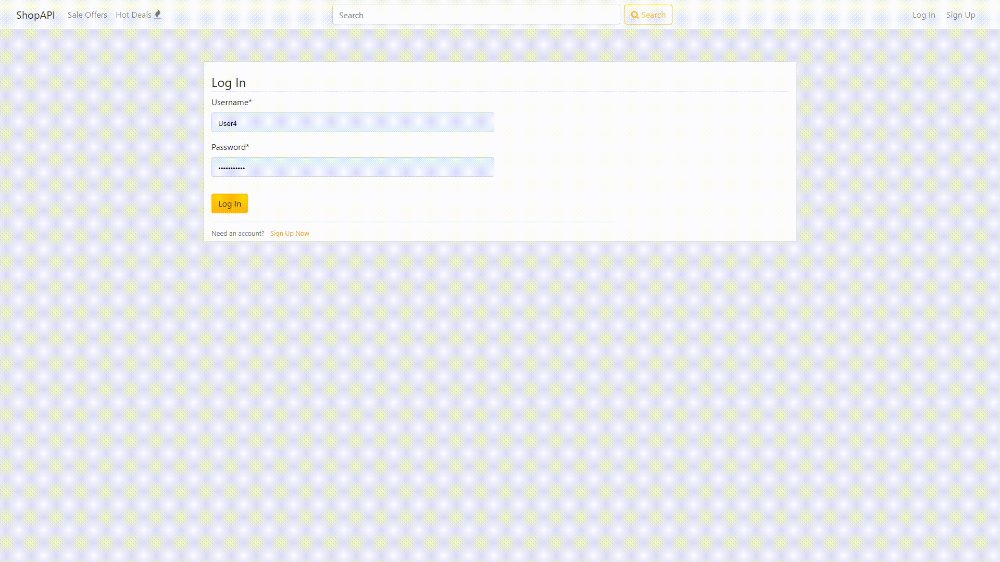

# ShopAPI
Available on https://shop-api-deploy.herokuapp.com

## Table of contents
* [General info](#general-info)
* [Features](#features)
* [Technologies](#technologies)
* [Installation](#installation)
* [Deployment](#deployment)
<!-- * [Gifs](#gifs) -->

## General info
A shop API that enables user to buy, post and create sale offers of particular items from many categories.

## Features
* Creating accounts
* Adding items
* Creating sale offers
* Filtering sales
* Searching items by name
* Ordering items
* Notification system
* Giving marks and comments after buying items
<!-- #### See the [Gifs](#gifs). -->

## Technologies
Project is created with:
* Python
* Django
* HTML
* CSS
* Bootstrap

## Installation
1) Create virtual environment

    ```
    python -m venv venv
    ```
    On linux:
    ```
    source venv/bin/activate
    ```
    On windows (cmd):
    ```
    venv\Scripts\activate.bat
    ```
2) Install prerequisites
   ```
   pip install -r requirments.txt
   ```
3) Run django
    ```
    python manage.py runserver
    ```
4) To check your application go to [localhost](http://127.0.0.1:5000/)

## Deployment
App is deployed on [Heroku](https://dashboard.heroku.com/) and available [here](https://shop-api-deploy.herokuapp.com)
<!-- 
## Gifs
### 1. Filters

### 2. Ordering items

### 3. Notification system
 -->
